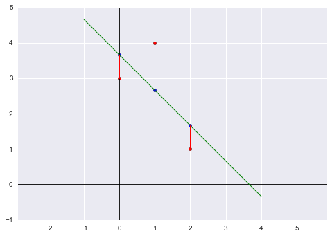

# 第三十五讲：期末复习

> [本章jupyter地址](https://github.com/Nicolas-gaofeng/Salute_Math/blob/main/jupyter/chapter35.ipynb)

依然是从以往的试题入手复习知识点。

1. *已知$m\times n$矩阵$A$，有$Ax=\begin{bmatrix}1\\0\\0\end{bmatrix}$无解；$Ax=\begin{bmatrix}0\\1\\0\end{bmatrix}$仅有唯一解，求关于$m,n,rank(A)$的信息。*

    首先，最容易判断的是$m=3$；而根据第一个条件可知，矩阵不满秩，有$r<m$；根据第二个条件可知，零空间仅有零向量，也就是矩阵消元后没有自由变量，列向量线性无关，所以有$r=n$。
    
    综上，有$m=3>n=r$。
    
    *根据所求写出一个矩阵$A$的特例*：$A=\begin{bmatrix}0&0\\1&0\\0&1\end{bmatrix}$。
    
    *$\det A^TA\stackrel{?}{=}\det AA^T$*：不相等，因为$A^TA$可逆而$AA^T$不可逆，所以行列式不相等。（但是对于方阵，$\det AB=\det BA$恒成立。）
    
    *$A^TA$可逆吗？*是，因为$r=n$，矩阵列向量线性无关，即列满秩。
    
    *$AA^T$正定吗？*否，因为$AA^T$是$3\times n$矩阵与$n\times 3$矩阵之积，是一个三阶方阵，而$AA^T$秩为$2$，所以不是正定矩阵。（不过$AA^T$一定是半正定矩阵。）
    
    *求证$A^Ty=c$至少有一个解*：因为$A$的列向量线性无关，所以$A^T$的行向量线性无关，消元后每行都有主元，且总有自由变量，所以零空间中有非零向量，零空间维数是$m-r$（可以直接从$\dim N\left(A^T\right)=m-r$得到结论）。

2. *设$A=\Bigg[v_1\ v_2\ v_3\Bigg]$，对于$Ax=v_1-v_2+v_3$，求$x$。*
   
    按列计算矩阵相乘，有$x=\begin{bmatrix}1\\-1\\1\end{bmatrix}$。
    
    *若Ax=v_1-v_2+v_3=0，则解是唯一的吗？为什么。*如果解释唯一的，则零空间中只有零向量，而在此例中$x=\begin{bmatrix}1\\-1\\1\end{bmatrix}$就在零空间中，所以解不唯一。
    
    *若$v_1,v_2,v_3$是标准正交向量，那么怎样的线性组合$c_1v_1+c_2v_2$能够最接近$v_3$？*此问是考察投影概念，由于是正交向量，所以只有$0$向量最接近$v_3$。
    
3. *矩阵$A=\begin{bmatrix}.2&.4&.3\\.4&.2&.3\\.4&.4&.4\end{bmatrix}$，求稳态。*

    这是个马尔科夫矩阵，前两之和为第三列的两倍，奇异矩阵总有一个特征值为$0$，而马尔科夫矩阵总有一个特征值为$1$，剩下一个特征值从矩阵的迹得知为$-.2$。
    
    再看马尔科夫过程，设从$u(0)$开始，$u_k=A^ku_0, u_0=\begin{bmatrix}0\\10\\0\end{bmatrix}$。先代入特征值$\lambda_1=0,\ \lambda_2=1,\ \lambda_3=-.2$查看稳态$u_k=c_1\lambda_1^kx_1+c_2\lambda_2^kx_2+c_3\lambda_3^kx_3$，当$k\to\infty$，第一项与第三项都会消失，剩下$u_\infty=c_2x_2$。
    
    到这里我们只需求出$\lambda_2$对应的特征向量即可，带入特征值求解$(A-I)x=0$，有$\begin{bmatrix}-.8&.4&.3\\.4&-.8&.3\\.4&.4&-.6\end{bmatrix}\begin{bmatrix}?\\?\\?\end{bmatrix}=\begin{bmatrix}0\\0\\0\end{bmatrix}$，可以消元得，也可以直接观察得到$x_2=\begin{bmatrix}3\\3\\4\end{bmatrix}$。
    
    剩下就是求$c_2$了，可以通过$u_0$一一解出每个系数，但是这就需要解出每一个特征值。另一种方法，我们可以通过马尔科夫矩阵的特性知道，对于马尔科夫过程的每一个$u_k$都有其分量之和与初始值分量之和相等，所以对于$x_2=\begin{bmatrix}3\\3\\4\end{bmatrix}$，有$c_2=1$。所以最终结果是$u_\infty=\begin{bmatrix}3\\3\\4\end{bmatrix}$。

4. *对于二阶方阵，回答以下问题：*
   
    *求投影在直线$a=\begin{bmatrix}4\\-3\end{bmatrix}$上的投影矩阵*：应为$P=\frac{aa^T}{a^Ta}$。
    
    *已知特征值$\lambda_1=2,\ x_1=\begin{bmatrix}1\\2\end{bmatrix}\quad \lambda_2=3,\ x_2=\begin{bmatrix}2\\1\end{bmatrix}$求原矩阵$A$*：从对角化公式得$A=S\Lambda S^{-1}=\begin{bmatrix}1&2\\2&1\end{bmatrix}\begin{bmatrix}0&0\\0&3\end{bmatrix}\begin{bmatrix}1&2\\2&1\end{bmatrix}^{-1}$，解之即可。
    
    *$A$是一个实矩阵，且对任意矩阵$B$，$A$都不能分解成$A=B^TB$，给出$A$的一个例子*：我们知道$B^TB$是对称的，所以给出一个非对称矩阵即可。
    *矩阵$A$有正交的特征向量，但不是对称的，给出一个$A$的例子*：我们在三十三讲提到过，反对称矩阵，因为满足$AA^T=A^TA$而同样具有正交的特征向量，所以有$A=\begin{bmatrix}0&1\\-1&0\end{bmatrix}$或旋转矩阵$\begin{bmatrix}\cos\theta&-\sin\theta\\\sin\theta&\cos\theta\end{bmatrix}$，这些矩阵都具有复数域上的正交特征向量组。
    
5. *最小二乘问题，因为时间的关系直接写出计算式和答案，$\begin{bmatrix}1&0\\1&1\\1&2\end{bmatrix}\begin{bmatrix}C\\D\end{bmatrix}=\begin{bmatrix}3\\4\\1\end{bmatrix}(Ax=b)$，解得$\begin{bmatrix}\hat C\\\hat D\end{bmatrix}=\begin{bmatrix}\frac{11}{3}\\-1\end{bmatrix}$。*

    *求投影后的向量$p$*：向量$p$就是向量$b$在矩阵$A$列空间中的投影，所以$p=\begin{bmatrix}p_1\\p_2\\p_3\end{bmatrix}=\begin{bmatrix}1&0\\1&1\\1&2\end{bmatrix}\begin{bmatrix}\hat C\\\hat D\end{bmatrix}$。
    
    *求拟合直线的图像*：$x=0,1,2$时$y=p_1,p_2,p_2$所在的直线的图像，$y=\hat C+\hat Dx$即$y=\frac{11}{3}-x$。


```python
%matplotlib inline
import matplotlib.pyplot as plt
from sklearn import linear_model
import numpy as np
import pandas as pd
import seaborn as sns

x = np.array([0, 1, 2]).reshape((-1,1))
y = np.array([3, 4, 1]).reshape((-1,1))
predict_line = np.array([-1, 4]).reshape((-1,1))

regr = linear_model.LinearRegression()
regr.fit(x, y)
ey = regr.predict(x)

fig = plt.figure()
plt.axis('equal')
plt.axhline(y=0, c='black')
plt.axvline(x=0, c='black')

plt.scatter(x, y, c='r')
plt.scatter(x, regr.predict(x), s=20, c='b')
plt.plot(predict_line, regr.predict(predict_line), c='g', lw='1')
[ plt.plot([x[i], x[i]], [y[i], ey[i]], 'r', lw='1') for i in range(len(x))]

plt.draw()
```





```python
plt.close(fig)
```

* 接上面的题目

    *求一个向量$b$使得最小二乘求得的$\begin{bmatrix}\hat C\\\hat D\end{bmatrix}=\begin{bmatrix}0\\0\end{bmatrix}$*：我们知道最小二乘求出的向量$\begin{bmatrix}\hat C\\\hat D\end{bmatrix}$使得$A$列向量的线性组合最接近$b$向量（即$b$在$A$列空间中的投影），如果这个线性组合为$0$向量（即投影为$0$），则$b$向量与$A$的列空间正交，所以可以取$b=\begin{bmatrix}1\\-2\\1\end{bmatrix}$同时正交于$A$的两个列向量。

# MIT线性代数的全部课程到此结束
